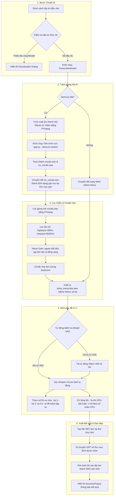

# Tài liệu Kiến trúc & Hướng dẫn Kỹ thuật Dự án Autocaption v2

Tài liệu này cung cấp cái nhìn chi tiết về kiến trúc hệ thống, các công nghệ sử dụng, cấu trúc mã nguồn, tác dụng của từng file và luồng xử lý dữ liệu của phần mềm tự động tạo phụ đề **Autocaption v2**.

---

## 1. Tổng quan các Công nghệ & Mô hình Sử dụng

Dự án tích hợp nhiều công nghệ hiện đại để tối ưu hóa hiệu năng dịch thuật offline và mang lại trải nghiệm giao diện người dùng mượt mà:

* **Ngôn ngữ lập trình chính**: Python 3.9+
* **Giao diện đồ họa (GUI)**: **PySide6 (Qt for Python)** - mang lại giao diện Dark-mode hiện đại, hỗ trợ hiệu ứng bóng đổ, bo góc và kéo thả (Drag & Drop).
* **Công cụ xử lý âm thanh**: **FFmpeg** - trích xuất âm thanh gốc, chuyển đổi định dạng, lọc nhiễu tần số, lọc cổng tiếng ồn (Noise Gate) và chuẩn hóa âm lượng.
* **Mô hình tách giọng AI**: **Demucs (Meta AI)** - tách giọng hát/nói (Vocal) khỏi nhạc nền (Accompaniment) một cách chính xác trước khi đưa vào Whisper dịch.
* **Engine dịch phụ đề (Speech-to-Text)**: **Whisper C++ (`whisper.cpp`)** - bản port C++ siêu nhẹ của OpenAI Whisper, tối ưu hóa CPU/GPU tốt hơn bản gốc chạy Python.
* **Bộ lọc khoảng lặng (VAD)**: **Silero VAD (`ggml-silero-vad.bin`)** - phát hiện giọng nói để Whisper bỏ qua nhạc dạo/khoảng lặng, chống ảo giác dịch nhầm hoặc lặp từ vô nghĩa.
* **Công nghệ đóng gói**: **PyInstaller** - cấu hình đóng gói tối ưu để tạo file chạy độc lập trên Windows mà không bị phình bộ nhớ RAM/VRAM do nạp DLL thừa.

---

## 2. Cấu trúc Thư mục Dự án

```
Autocaption-v2/
├── app.py                      # Điểm khởi chạy giao diện GUI & Subprocess Worker
├── AutoCaption4DR.lua          # Script tích hợp một chạm cho DaVinci Resolve
├── requirements.txt            # Danh sách thư viện Python phụ thuộc
├── WhisperSubtitler.spec       # Cấu hình biên dịch đóng gói ứng dụng bằng PyInstaller
├── DOC.md                      # [File này] Tài liệu kiến trúc kỹ thuật chi tiết
├── README.md                   # Hướng dẫn cài đặt và sử dụng cho người dùng cuối
└── src/                        # Thư mục mã nguồn chính của ứng dụng
    ├── __init__.py             # Đánh dấu src là một package Python
    ├── assets/
    │   └── AutoCaption.css     # Định nghĩa kiểu dáng CSS giao diện Dark-mode
    ├── core/
    │   ├── __init__.py
    │   ├── config.py           # Định nghĩa các hằng số, đường dẫn và link tải tài nguyên
    │   └── utils.py            # Các hàm tiện ích (dò tìm GPU, tải CSS, kiểm tra file...)
    ├── ui/
    │   ├── __init__.py
    │   ├── components.py       # Thành phần giao diện dùng chung (thẻ file, vùng kéo thả...)
    │   ├── downloader.py       # Hộp thoại tự động tải FFmpeg, Whisper CLI và Whisper Models
    │   └── main_window.py      # Cửa sổ chính quản lý trạng thái giao diện và tương tác
    └── workers/
        ├── __init__.py
        ├── download_worker.py   # Quản lý luồng chạy ngầm tải tài nguyên hệ thống
        └── transcribe_worker.py # Quản lý luồng xử lý âm thanh, tách nhạc và chạy Whisper
```

---

## 3. Tác dụng Chi tiết của Từng File

### A. Thư mục gốc (Root)
* **[app.py](file:///d:/Project/Autocaption-v2/app.py)**: 
  * Là điểm khởi chạy chính của ứng dụng.
  * Đóng vai trò kép: khởi động giao diện PySide6 và xử lý tham số `--demucs-worker` từ tiến trình con. Khi được gọi bằng cờ này, file nạp PyTorch và chạy Demucs độc lập nhằm tối ưu hóa giải phóng 100% RAM sau khi hoàn tất.
* **[AutoCaption4DR.lua](file:///d:/Project/Autocaption-v2/AutoCaption4DR.lua)**:
  * Script viết bằng Lua chạy trực tiếp trong phần mềm làm phim **DaVinci Resolve** (Fusion).
  * Cho phép người dùng Resolve tạo phụ đề nhanh cho clip đang chỉnh sửa bằng cách gọi trực tiếp các file thực thi `whisper-cli.exe` và `ffmpeg.exe` trong thư mục của ứng dụng mà không cần cài đặt Python.
* **[requirements.txt](file:///d:/Project/Autocaption-v2/requirements.txt)**:
  * Liệt kê các thư viện Python cần thiết: `PySide6`, `demucs`, `soundfile`, `pyinstaller`.
* **[WhisperSubtitler.spec](file:///d:/Project/Autocaption-v2/WhisperSubtitler.spec)**:
  * File cấu hình hướng dẫn PyInstaller đóng gói ứng dụng thành file `.exe` duy nhất.
  * Loại bỏ các thư viện toán học/vẽ đồ thị không cần thiết (`sympy`, `matplotlib`...) để giảm dung lượng file nén.
* **[README.md](file:///d:/Project/Autocaption-v2/README.md)**:
  * Tài liệu hướng dẫn cài đặt nhanh, giới thiệu các tính năng và cách sử dụng cho người dùng.

### B. Module core (`src/core/`)
* **[config.py](file:///d:/Project/Autocaption-v2/src/core/config.py)**:
  * Chứa toàn bộ cấu hình tĩnh: Danh sách URL tải các phiên bản Whisper CLI (CPU/GPU), các phiên bản mô hình Whisper (Tiny, Base, Small, Medium, Large V3 Turbo), và các đuôi định dạng video/âm thanh được hỗ trợ.
  * Tự động tạo các thư mục lưu trữ cục bộ: `bin/` và `bin/models/`.
* **[utils.py](file:///d:/Project/Autocaption-v2/src/core/utils.py)**:
  * Chứa các chức năng trợ giúp độc lập hệ thống:
    * `get_cuda_version()` & `check_gpu_available()`: Gọi lệnh `nvidia-smi` để kiểm tra máy tính có card đồ họa NVIDIA hỗ trợ CUDA hay không và xác định phiên bản CUDA thích hợp.
    * `load_stylesheet()`: Đọc tệp tin CSS giao diện để áp dụng hiệu ứng cho cửa sổ.
    * `check_system_assets()`: Kiểm tra xem các file chạy cần thiết như `ffmpeg.exe`, `whisper-cli.exe` và các mô hình dịch đã có sẵn trong thư mục ứng dụng hay chưa.

### C. Module giao diện (`src/ui/`)
* **[components.py](file:///d:/Project/Autocaption-v2/src/ui/components.py)**:
  * Thiết kế các widget giao diện Qt tùy biến:
    * `CardFrame`: Thẻ hiển thị file nhỏ, bo góc đẹp mắt cho mỗi tệp tin được chọn. Nhấp đúp vào thẻ để xóa tệp đó khỏi danh sách chờ.
    * `DropZoneFrame`: Vùng nhận diện sự kiện kéo thả file từ Windows Explorer.
    * `SuccessPopup`: Hộp thoại hiện lên thông báo kết quả chi tiết khi dịch phụ đề hoàn tất.
* **[downloader.py](file:///d:/Project/Autocaption-v2/src/ui/downloader.py)**:
  * Thiết kế hộp thoại tải xuống tài nguyên.
  * Cho phép người dùng chọn cấu hình tải mô hình Whisper mặc định hoặc dán link tải mô hình tùy chọn (GGML `.bin`).
* **[main_window.py](file:///d:/Project/Autocaption-v2/src/ui/main_window.py)**:
  * Trung tâm điều khiển giao diện chính của ứng dụng.
  * Quản lý lưu/tải thiết lập của người dùng thông qua `QSettings` (như thư mục lưu cuối, ngôn ngữ dịch, thiết bị phần cứng, số luồng CPU).
  * Điều phối việc tắt/mở khung hiển thị Log, cập nhật tiến trình chạy và điều hướng khởi tạo `TranscribeWorker`.

### D. Module luồng chạy ngầm (`src/workers/`)
* **[download_worker.py](file:///d:/Project/Autocaption-v2/src/workers/download_worker.py)**:
  * Một `QObject` chạy trong luồng phụ để tải các file kích thước lớn từ internet (FFmpeg zip, Whisper zip, mô hình dịch) mà không gây đơ/treo giao diện chính.
  * Tự động giải nén và di chuyển file thực thi vào thư mục `bin/` sau khi tải xong.
* **[transcribe_worker.py](file:///d:/Project/Autocaption-v2/src/workers/transcribe_worker.py)**:
  * Trái tim của ứng dụng. Đây là luồng con (`QThread`) thực hiện toàn bộ quá trình chuyển đổi âm thanh, chạy tách AI và điều hành Whisper để tạo ra file `.srt` cuối cùng.

---

## 4. Luồng Xử lý Dữ liệu (Processing Pipeline)

Khi người dùng nhấn nút **"BẮT ĐẦU TẠO PHỤ ĐỀ"**, luồng xử lý dữ liệu sẽ chạy qua 5 bước chính:



### Chi tiết các giai đoạn xử lý:

#### 1. Bước chuẩn bị (Input & Setup)
Hệ thống thu thập danh sách tệp tin đầu vào (hỗ trợ kéo thả hàng loạt). Chương trình thực hiện kiểm tra nhanh sự tồn tại của `ffmpeg.exe`, `whisper-cli.exe` (hoặc `main.exe`) và mô hình Whisper định dạng `.bin`.

#### 2. Tách giọng hát (Vocal Separation - Demucs AI)
* Nếu người dùng chọn **"Tách giọng nói bằng Demucs"**, ứng dụng sẽ sử dụng phương pháp cô lập tiến trình con để tránh rò rỉ RAM trên Windows.
* Lệnh gọi: `python app.py --demucs-worker <mức_tách> <thư_mục_tạm> <tệp_gốc> <thiết_bị> <phân_đoạn>`
* Hệ điều hành Windows tự động thu hồi 100% tài nguyên RAM/VRAM ngay sau khi tiến trình con kết thúc.
* Sau khi tách thành công, tệp nhạc không lời (`accompaniment`) sẽ được chuyển đổi về định dạng và bit-rate gốc của tệp video nguồn (ví dụ: `.mp3` hoặc `.m4a`) và lưu ngay cạnh file gốc để người dùng làm video Karaoke. Tệp giọng nói (`vocals.wav`) sẽ tiếp tục đi vào bước lọc.

#### 3. Lọc nhiễu & Chuẩn hóa giọng nói (Audio Enhancement)
Giọng nói trích xuất được đi qua một bộ lọc âm thanh nâng cao thông qua FFmpeg:
* `highpass=f=80,lowpass=f=8000`: Loại bỏ tiếng ù tần số thấp và tiếng rít tần số cao không thuộc dải giọng người nói.
* `agate=threshold=0.02:range=0.1`: Lọc cổng tiếng ồn (Noise Gate) để triệt tiêu tiếng vang (de-reverb) và các âm thanh xì xào nhỏ trong khoảng lặng.
* `loudnorm`: Chuẩn hóa âm lượng về mức chuẩn công nghiệp, giúp Whisper nhận diện rõ ràng các từ nói thì thầm hoặc nói quá to.
* Định dạng đầu ra bắt buộc: Tần số lấy mẫu **16000Hz (16kHz)**, **Mono (1 kênh)** và mã hóa **PCM 16-bit**.

#### 4. Chạy dịch thuật ngoại tuyến (Offline Transcription Engine)
Ứng dụng gọi tệp thực thi Whisper C++ với danh sách tham số tối ưu hóa:
* `-m`: Chỉ định đường dẫn tới mô hình Whisper đã chọn.
* `-l`: Chỉ định mã ngôn ngữ dịch (hoặc `auto` để tự động dò tìm).
* `-t`: Số lượng luồng xử lý CPU song song.
* `--vad -vm`: Kích hoạt bộ phát hiện giọng nói Silero để bỏ qua hoàn toàn các đoạn không có tiếng nói, triệt tiêu ảo giác Whisper dịch nhầm nhạc dạo thành chữ.
* `-fa` (Flash Attention) / `-ng` (No GPU): Tự động bật tăng tốc phần cứng card đồ họa NVIDIA nếu có hỗ trợ CUDA.
* `-bs 5 -bo 5 -tp 0.0 -nf`: Cấu hình thuật toán Beam Search chặt chẽ, tắt chế độ tự động thử lại nhiệt độ (fallback) giúp ngăn chặn lỗi lặp từ vô nghĩa khi ca sĩ ngân dài.

#### 5. Đóng gói & Dọn dẹp (Output & Cleanup)
* Nhận kết quả dịch dạng `.srt` từ Whisper.
* Tự động di chuyển tệp phụ đề về thư mục lưu trữ mong muốn (cùng thư mục file gốc hoặc thư mục được chỉ định).
* Xóa sạch các tệp WAV tạm (`temp_transcribe_*.wav`, `temp_vocal_*.wav`) để giải phóng dung lượng ổ cứng.
* Cửa sổ hiển thị thông báo hoàn tất, cho phép người dùng nhấp vào nút **"Mở thư mục"** để xem ngay file phụ đề.

---

## 5. Hướng dẫn Xử lý các Lỗi Thường Gặp (Troubleshooting)

Trong quá trình khởi chạy và vận hành ứng dụng ngoại tuyến, người dùng có thể gặp một số lỗi kỹ thuật. Dưới đây là cách khắc phục chi tiết:

### A. Lỗi thiếu thư viện Python (ModuleNotFoundError / ImportError)
* **Triệu chứng**: Giao diện không khởi động hoặc terminal báo lỗi `ModuleNotFoundError: No module named 'PySide6'` hoặc `ImportError`.
* **Nguyên nhân**: Chưa cài đặt đầy đủ các gói phụ thuộc hoặc chưa kích hoạt đúng môi trường ảo.
* **Cách khắc phục**:
  1. Mở Terminal/CMD tại thư mục dự án.
  2. Tạo môi trường ảo (nếu chưa có): `python -m venv .venv`
  3. Kích hoạt môi trường ảo:
     * Windows: `.venv\Scripts\activate`
     * macOS/Linux: `source .venv/bin/activate`
  4. Cài đặt lại các thư viện: `pip install -r requirements.txt`

### B. Ứng dụng không nhận diện được GPU (CUDA)
* **Triệu chứng**: Thiết bị phần cứng chỉ hiển thị duy nhất tùy chọn **"CPU"** hoặc hiển thị **"GPU (CUDA) - Not Available"** (bị vô hiệu hóa).
* **Nguyên nhân**: Driver GPU NVIDIA chưa cài đặt, phiên bản CUDA không tương thích, hoặc thiếu thư viện động CUDA backend (`ggml-cuda.dll`) trong Whisper.cpp.
* **Cách khắc phục**:
  1. Kiểm tra xem driver NVIDIA đã hoạt động hay chưa bằng cách gõ lệnh `nvidia-smi` vào CMD. Nếu báo lỗi, hãy cập nhật Driver Card đồ họa lên phiên bản mới nhất từ trang chủ NVIDIA.
  2. Đảm bảo cài đặt PyTorch phiên bản hỗ trợ GPU CUDA cho mô hình tách nhạc Demucs. Bạn có thể cài đặt bằng lệnh:
     `pip install torch torchaudio --index-url https://download.pytorch.org/whl/cu121` (hoặc thay đổi `cu121` thành bản phù hợp như `cu118`).
  3. Đối với Whisper.cpp, hãy kiểm tra xem trong thư mục `bin/` hoặc `bin/Release/` đã có file `ggml-cuda.dll` chưa. Nếu chưa, hãy xóa file `whisper-cli.exe` để ứng dụng tự động kích hoạt hộp thoại Downloader tải lại bản dựng GPU tối ưu phù hợp với phiên bản CUDA của máy bạn (CUDA 11.x hoặc 12.x).

### C. Lỗi tràn bộ nhớ GPU (Out of Memory - OOM) khi tách nhạc Demucs
* **Triệu chứng**: Log xử lý báo lỗi `CUDA out of memory` hoặc tiến trình tách giọng bị sập giữa chừng làm ứng dụng chính báo hủy.
* **Nguyên nhân**: Card đồ họa (VRAM) của máy yếu hoặc file âm thanh/video đầu vào quá dài khiến mô hình AI Demucs chiếm dụng hết bộ nhớ GPU.
* **Cách khắc phục**:
  1. Mặc định, ứng dụng đã tự động áp dụng cờ tối ưu `--segment 5` để chia nhỏ dữ liệu xử lý trên GPU.
  2. Tại bảng cấu hình của giao diện chính, ở mục **"Mức tách Demucs"**, hãy chọn tùy chọn **"mdx_extra_q (Nhanh - Tiết kiệm RAM)"** thay vì các mô hình mặc định.
  3. Nếu vẫn tiếp tục bị sụp đổ, hãy đổi tùy chọn **"Phần cứng"** sang **"CPU"** để tiến trình sử dụng RAM hệ thống thay vì VRAM.

### D. Lỗi FFmpeg không thể hoạt động (FFmpeg failed / Audio conversion failed)
* **Triệu chứng**: Log báo lỗi trích xuất âm thanh thất bại hoặc không thể chuyển đổi định dạng WAV 16kHz.
* **Nguyên nhân**: Tệp thực thi `ffmpeg.exe` trong thư mục `bin/` bị hỏng, bị chặn bởi phần mềm diệt virus hoặc không có quyền truy cập.
* **Cách khắc phục**:
  1. Kiểm tra xem tệp `ffmpeg.exe` đã nằm trong thư mục `bin/` chưa.
  2. Nếu tệp có tồn tại nhưng lỗi, hãy xóa tệp đó và khởi chạy lại `app.py`. Hộp thoại Downloader sẽ xuất hiện và tải xuống bản FFmpeg sạch chính thức.
  3. Kiểm tra xem tệp video đầu vào có bị lỗi định dạng hoặc bị mã hóa hay không bằng cách thử chạy trực tiếp video đó trên trình phát video của máy.
