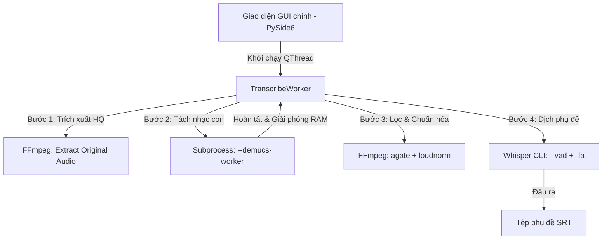

# Tài liệu kiến trúc và hướng dẫn kỹ thuật dự án Autocaption v2

Tài liệu này mô tả chi tiết kiến trúc hệ thống, luồng xử lý dữ liệu âm thanh, cơ chế quản lý bộ nhớ RAM/VRAM và các tối ưu hóa phần cứng đã áp dụng trong phiên bản v2.

---

## 1. Kiến trúc luồng xử lý dữ liệu (Application Architecture)

Ứng dụng được xây dựng trên nền tảng **PySide6 (Qt for Python)** và chạy đa luồng để tránh đơ/treo giao diện:



### A. Luồng giao diện (GUI Thread)
* Quản lý giao diện, tương tác kéo thả tệp tin và hiển thị log thời gian thực.
* Gọi lệnh phát hiện thiết bị GPU (`nvidia-smi`) khi khởi động để cấu hình tùy chọn phù hợp cho người dùng.

### B. Luồng công việc (TranscribeWorker - QThread)
* Xử lý tuần tự các tệp đầu vào mà không chặn đứng GUI chính.
* Giao tiếp với GUI thông qua hệ thống Signal/Slot của Qt (`log_signal`, `progress_signal`, `status_signal`).

---

## 2. Giải pháp quản lý bộ nhớ RAM & VRAM (Demucs Subprocess Worker)

### Vấn đề gặp phải
Khi nạp trực tiếp PyTorch, Torchaudio và các thư viện Demucs vào luồng ứng dụng chính (`in-process`), Windows sẽ tải các tệp DLL khổng lồ vào bộ nhớ. Do giới hạn của hệ điều hành, các DLL này **không thể unload** thủ công kể cả khi gọi `gc.collect()` hay `torch.cuda.empty_cache()`, khiến GUI chính bị phình to RAM lên đến **~940MB**.

### Giải pháp cô lập tiến trình con (Subprocess)
* Khi cần tách nhạc, `TranscribeWorker` sẽ khởi tạo một tiến trình con thông qua `subprocess.Popen` gọi chính tệp `.exe` (hoặc tập lệnh Python) kèm cờ `--demucs-worker`:
  ```bash
  WhisperSubtitler.exe --demucs-worker <model_name> <out_dir> <input_file> <device> <segment>
  ```
* Tiến trình con này độc lập nạp PyTorch và thực hiện tách âm thanh.
* Log từ tiến trình con được dẫn truyền (pipe) thời gian thực về GUI chính.
* Khi tiến trình con kết thúc (exit), hệ điều hành Windows **thu hồi 100% tài nguyên bộ nhớ**, đưa RAM ứng dụng GUI chính trở lại mức ban đầu **~38MB**.
* Để bảo vệ bộ nhớ GPU (VRAM) yếu, tham số `--segment 5` được truyền vào giúp chia nhỏ phân đoạn xử lý của Demucs tránh lỗi tràn bộ nhớ (Out of Memory).

---

## 3. Luồng xử lý âm thanh chi tiết (Audio Pipeline)

Để đảm bảo chất lượng nhạc nền Karaoke tốt nhất và khả năng dịch chính xác nhất của Whisper, âm thanh đi qua luồng lọc sau:

1. **Trích xuất âm thanh gốc chất lượng cao (HQ Stereo)**:
   * FFmpeg trích xuất âm thanh giữ nguyên codec gốc và tần số lấy mẫu gốc từ tệp video đầu vào (ví dụ: AAC hoặc MP3).
2. **Tách nhạc Demucs (Vocal / Accompaniment)**:
   * Tách âm thanh gốc thành: `vocals.wav` (Giọng hát) và `accompaniment` (Nhạc nền Karaoke chất lượng gốc).
3. **Tăng cường âm thanh & Lọc ồn giọng hát**:
   * Giọng hát `vocals.wav` được đưa qua bộ lọc FFmpeg:
     * `highpass=f=80,lowpass=f=8000`: Cắt bỏ tần số quá cao/quá trầm không phải giọng người.
     * `agate=threshold=0.02:range=0.1`: Bộ lọc Noise Gate (ngưỡng nhạy `-34dB`) giúp triệt tiêu tiếng vang (de-reverb) và tạp âm nhỏ mà không làm mất các đoạn thì thầm nhỏ.
     * `loudnorm`: Chuẩn hóa âm lượng giọng nói trước khi đưa vào Whisper dịch.

---

## 4. Cấu hình Whisper Engine tối ưu

Tiến trình dịch phụ đề chạy thông qua `whisper-cli.exe` với các tham số tối ưu hóa chuyên sâu:

* **`--vad` (Voice Activity Detection)**: Tích hợp bộ phát hiện giọng nói để loại bỏ khoảng lặng/nhạc dạo trước khi dịch, triệt tiêu lỗi dịch nhầm khi có nhạc nền.
* **`-fa` (Flash Attention)**: Tự động kích hoạt khi chạy bằng **GPU**, tận dụng thuật toán tăng tốc phần cứng của card đồ họa giúp đẩy nhanh tốc độ dịch thêm **20% - 40%**.
* **`-bs 5 -bo 5`**: Cấu hình tìm kiếm Beam Search tốt nhất để nâng cao chất lượng dịch chữ.
* **`-tp 0.0`**: Đặt nhiệt độ lấy mẫu cố định bằng 0 để đảm bảo tính nhất quán cao nhất của từ ngữ dịch ra.
* **`-nf` (No-Fallback)**: Tắt tính năng tự tăng nhiệt độ thử lại để chống lỗi lặp từ vô tận khi ca sĩ ngân nốt dài.

---

## 5. Tối ưu đóng gói PyInstaller (`WhisperSubtitler.spec`)

Để giảm dung lượng thư mục đóng gói và tăng hiệu năng khởi chạy ứng dụng:

* **Excludes**: Loại bỏ hoàn toàn các gói toán học/vẽ đồ thị không dùng đến của PyTorch/PySide6:
  `sympy`, `mpmath`, `networkx`, `antlr4`, `matplotlib`, `sqlite3`, `win32com`, `pythonwin`, `google`, `markupsafe`, `jinja2`, `fsspec`.
* **Optimize Level 2 (`optimize=2`)**: Yêu cầu PyInstaller tối ưu hóa bytecode của Python, loại bỏ các comment docstring và các lệnh assert giúp thu gọn kích thước tệp `.pyz`.
